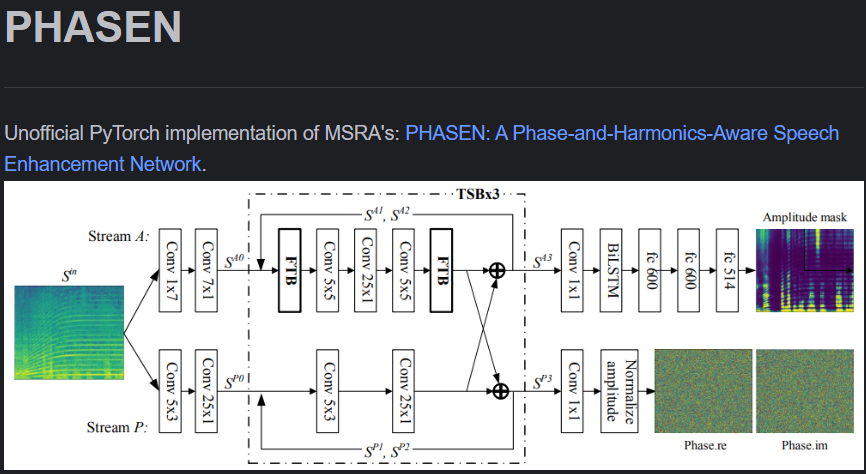

# phasen降噪神经网络

## 处理原理

## 项目结构

* noisy
* ├── data
* │   ├── clean_testset_wav
* │   ├── clean_trainset_28spk_wav
* │   ├── clean_trainset_56spk_wav
* │   ├── noisy_testset_wav
* │   ├── noisy_trainset_28spk_wav
* │   ├── noisy_trainset_56spk_wav
* │   ├── testset_txt
* │   ├── trainset_28spk_txt
* │   ├── trainset_56spk_txt
* │   ├── license_text
* │   ├── log_readme.txt
* │   ├── log_testset.txt
* │   ├── log_trainset_28spk.txt
* │   └── log_trainset_56spk.txt
* ├── lib
* │   ├── __init__.py
* │   ├── dataset.py
* │   ├── model.py
* │   └── utils.py
* ├── model
* ├── src
* │   ├── train.py
* │   └── test.py
* ├── .gitignore
* ├── README.md
* └── requirements.txt